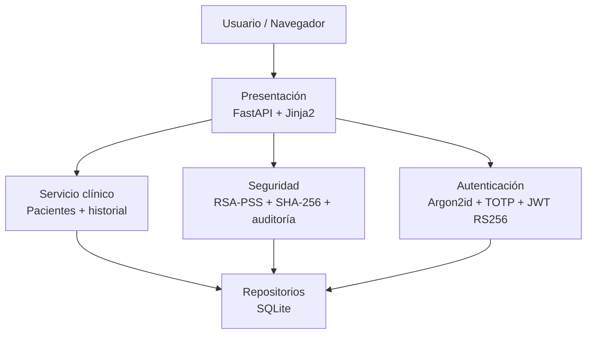
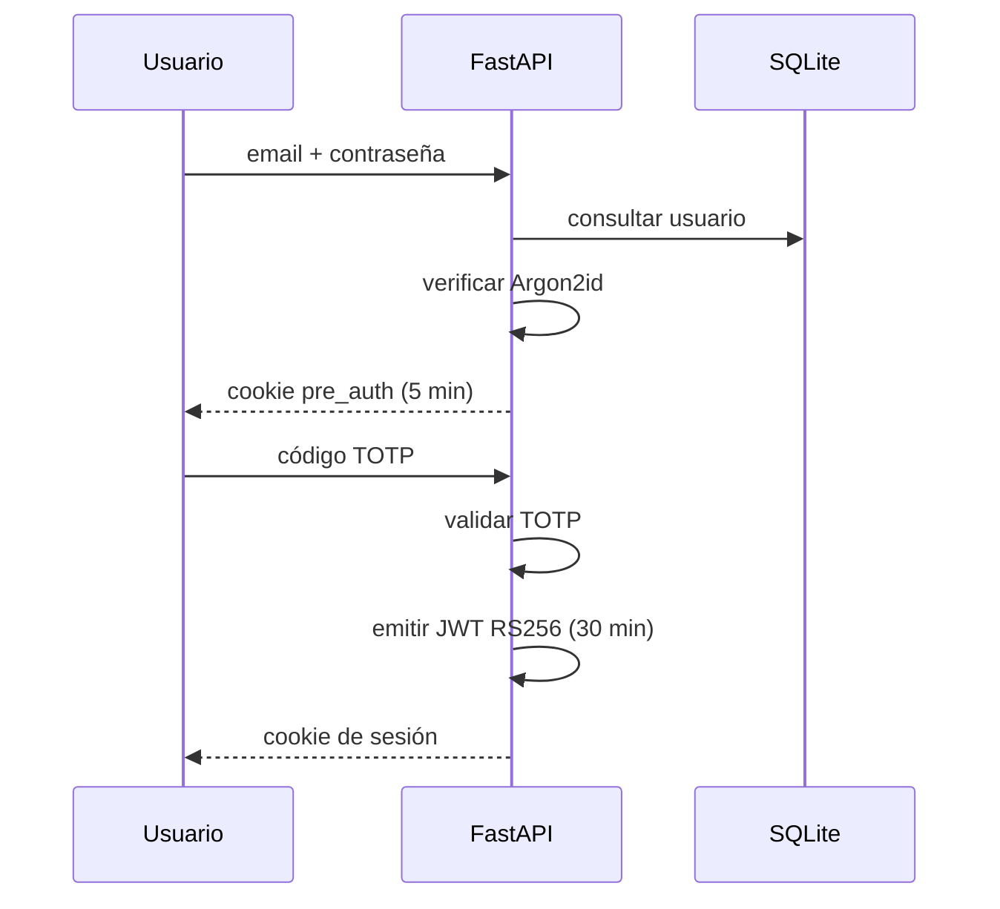

# Clínica Segura

**Demostrador académico de ciberseguridad aplicado a un expediente clínico electrónico.**

Clínica Segura implementa mecanismos reales de autenticación, firma digital, control de acceso y auditoría para demostrar tres propiedades centrales de seguridad: **autenticidad, no repudio y trazabilidad**. El proyecto está construido con **Python 3.12, FastAPI, Jinja2 y SQLite** y está pensado para ejecutarse localmente durante una presentación técnica.

> [!IMPORTANT]
> Este repositorio es una **demo académica**. No está diseñado para almacenar información clínica real ni para desplegarse como sistema de producción.

## Objetivos de seguridad

| Principio | Implementación | Propósito |
|---|---|---|
| Autenticidad | Argon2id + TOTP + JWT RS256 | Verificar la identidad antes de emitir una sesión autenticada |
| No repudio | SHA-256 + firma RSA-PSS | Asociar criptográficamente una nota clínica con el médico que la creó |
| Trazabilidad | Cadena SHA-256 + triggers SQLite | Detectar alteraciones y conservar evidencia de acciones relevantes |

Controles adicionales: **RBAC**, CSRF con double-submit cookie, `SameSite=Strict`, rate limiting, consultas SQL parametrizadas, Jinja2 autoescape y desactivación de Swagger/ReDoc en la aplicación.

## Arquitectura



El proyecto utiliza separación por responsabilidades y aplica los patrones **Repository, Factory, Decorator y Strategy**. La arquitectura y sus límites están documentados en [`docs/arquitectura.md`](docs/arquitectura.md).

## Estructura del repositorio

```text
clinica-segura/
├── .github/
│   └── workflows/
│       └── tests.yml
├── app/
│   ├── autenticacion/
│   ├── clinico/
│   ├── datos/
│   ├── presentacion/
│   ├── seguridad/
│   ├── plantillas/
│   ├── estaticos/
│   ├── config.py
│   ├── fabrica.py
│   └── main.py
├── db/
│   ├── esquema.sql
│   ├── semilla.py
│   └── __init__.py
├── docs/
│   ├── arquitectura.md
│   ├── seguridad.md
│   ├── demo.md
│   ├── revision-seguridad.md
│   └── diagramas-hospital.pdf
├── llaves/
│   └── .gitkeep
├── tests/
│   └── test_smoke.py
├── .env.example
├── .gitignore
├── CHANGELOG.md
├── README.md
├── TESTING.md
├── requirements.txt
└── requirements-dev.txt
```

## Tecnologías

- Python 3.12
- FastAPI
- Uvicorn
- Jinja2
- SQLite
- Argon2id (`argon2-cffi`)
- TOTP / RFC 6238 (`pyotp`)
- JWT RS256 (`PyJWT`)
- RSA-PSS y SHA-256 (`cryptography`)
- Pytest + HTTPX

## Instalación rápida

Desde la raíz del proyecto:

```bash
python -m pip install -r requirements.txt
python -m db.semilla
python -m uvicorn app.main:app --reload --host 127.0.0.1 --port 8000
```

Abrir:

```text
http://127.0.0.1:8000
```

Para el entorno Windows utilizado en la presentación y para ejecutar las pruebas, consultar [`TESTING.md`](TESTING.md).

## Variables de entorno

El archivo `.env` **no se versiona**. El repositorio incluye `.env.example` como referencia.

| Variable | Uso |
|---|---|
| `DEMO_MODE` | Habilita las rutas de demostración `/demo/*` |
| `SECRET_KEY` | Firma la cookie temporal utilizada entre contraseña y TOTP |

Para una demo local:

```powershell
$env:DEMO_MODE = "true"
$env:SECRET_KEY = python -c "import secrets; print(secrets.token_urlsafe(48))"
```

## Credenciales de demostración

La semilla genera usuarios locales con la contraseña compartida:

```text
Demo2026!
```

| Usuario | Rol | Uso principal |
|---|---|---|
| `admin@clinica.mx` | Administrador | Gestión de usuarios y auditoría |
| `laura.mendez@clinica.mx` | Doctora | Consultar expedientes y crear notas firmadas |
| `carlos.rios@clinica.mx` | Doctor | Consultar expedientes y crear notas firmadas |
| `ana.torres@clinica.mx` | Enfermera | Consulta de expedientes, sin creación de notas ni auditoría |

> [!WARNING]
> `Demo2026!`, `/demo/codigos` y las rutas de ataque son recursos intencionales para la exposición. No representan una configuración aceptable de producción.

## Flujo de autenticación



## Pruebas

La suite automatizada cubre la semilla, integridad inicial, MFA, autorización, CSRF, rate limiting, concurrencia de auditoría, detección de manipulación e invalidación de sesión tras restaurar la demo.

```bash
python -m pip install -r requirements-dev.txt
python -m pytest -q
```

La guía completa está en [`TESTING.md`](TESTING.md).

## Guion de demostración

El recorrido recomendado para la presentación es:

1. Iniciar sesión con contraseña.
2. Completar TOTP.
3. Consultar un expediente.
4. Crear una nota clínica y firmarla con la llave privada del médico.
5. Mostrar hash SHA-256 y firma RSA-PSS.
6. Ejecutar una modificación directa de la nota desde el panel de demo.
7. Ejecutar la verificación de integridad y mostrar la detección de contenido alterado.
8. Intentar eliminar un registro de auditoría y mostrar el rechazo del trigger SQLite.
9. Mostrar eventos de sesión y accesos denegados.

Detalle operativo: [`docs/demo.md`](docs/demo.md).

## Documentación

- [Arquitectura](docs/arquitectura.md)
- [Modelo de seguridad](docs/seguridad.md)
- [Guion de demostración](docs/demo.md)
- [Revisión y hardening](docs/revision-seguridad.md)
- [Pruebas](TESTING.md)
- [Historial de cambios](CHANGELOG.md)

## Alcance y limitaciones

El proyecto demuestra controles de seguridad en un entorno local. No implementa una arquitectura de producción completa. Entre las limitaciones conocidas se encuentran:

- SQLite como almacenamiento local.
- Llaves criptográficas almacenadas en el sistema de archivos.
- `DEMO_MODE=true` habilita funciones que deliberadamente reducen seguridad para facilitar la exposición.
- Las cookies se utilizan sobre HTTP local y no establecen `Secure`.
- El rate limiter es en memoria y está diseñado para un único proceso Uvicorn.
- La creación de una nota y su evento de auditoría todavía se confirman en transacciones separadas.
- `ip_origen` se registra, pero no forma parte de la fórmula actual de la cadena SHA-256.

Estas limitaciones se documentan de forma explícita para diferenciar una **demostración de principios** de un sistema clínico listo para producción.

## Uso

Proyecto académico y de demostración. No utilizar con datos clínicos, credenciales o información personal reales.
