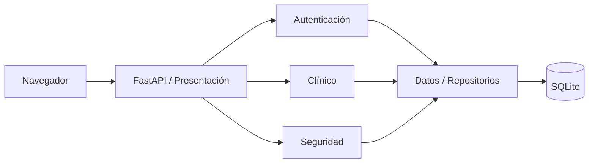
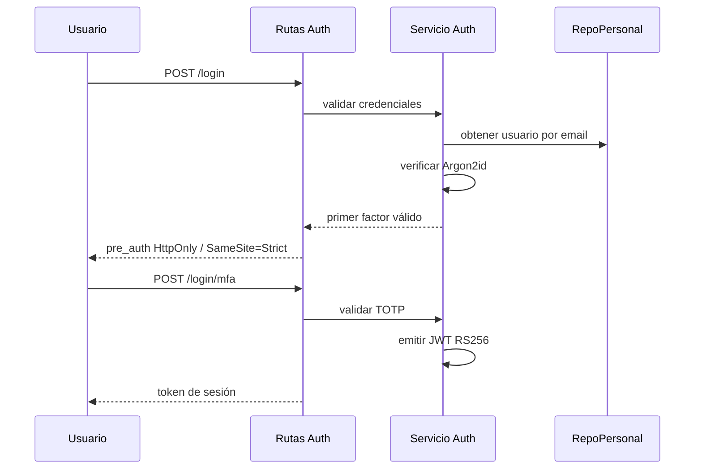
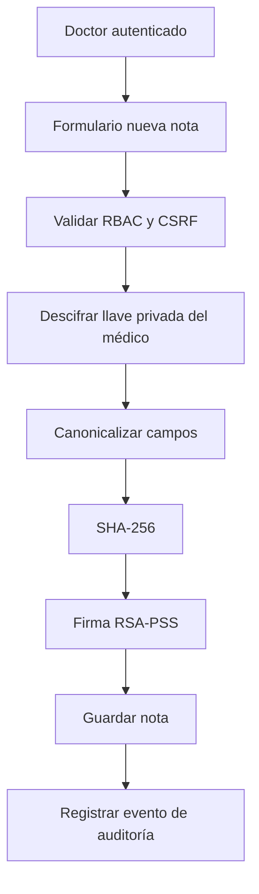
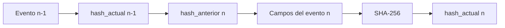
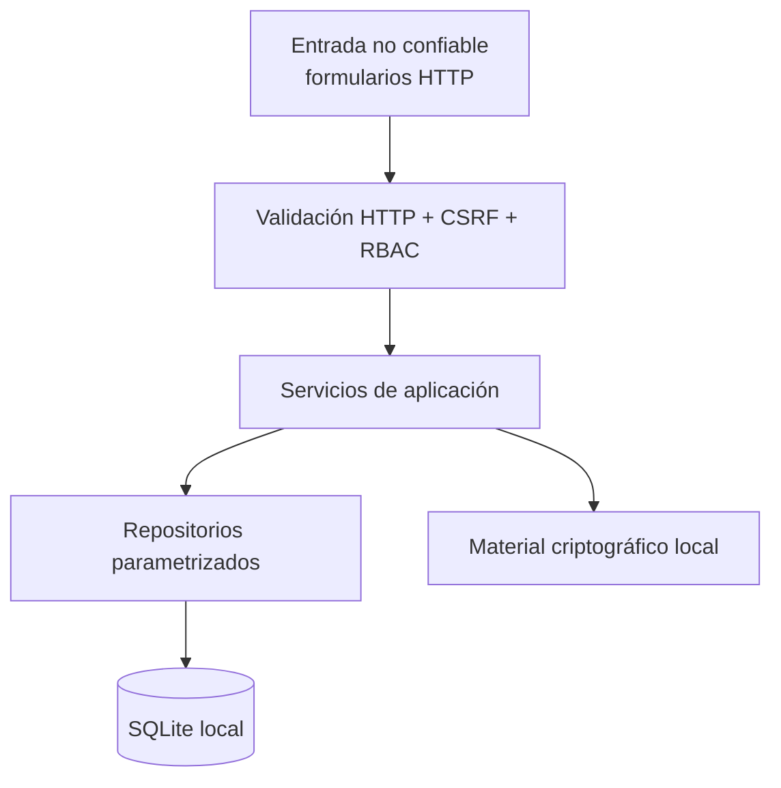

# Arquitectura de Clínica Segura

## 1. Propósito

La arquitectura busca separar presentación, autenticación, lógica clínica, controles de seguridad y acceso a datos para que cada responsabilidad pueda revisarse y probarse de manera independiente.

El sistema se ejecuta localmente con **FastAPI + Jinja2 + SQLite** y no necesita servicios externos para la demostración.

## 2. Vista general



## 3. Capas y módulos

| Área | Directorio | Responsabilidad |
|---|---|---|
| Presentación | `app/presentacion/` | Rutas HTTP, formularios, cookies, redirecciones y renderizado Jinja2 |
| Autenticación | `app/autenticacion/` | Contraseñas Argon2id, TOTP, emisión y validación JWT |
| Clínica | `app/clinico/` | Modelos y operaciones del dominio clínico |
| Seguridad | `app/seguridad/` | RSA-PSS, SHA-256, auditoría, verificador, llaves y rate limiting |
| Datos | `app/datos/` | Conexión SQLite y repositorios con SQL parametrizado |
| Ensamblado | `app/fabrica.py` | Construcción principal de servicios y repositorios |
| Persistencia | `db/` | Esquema, triggers y datos de demostración |

## 4. Patrones de diseño

### Repository

Los repositorios encapsulan el acceso SQL:

- `RepoPersonal`
- `RepoPacientes`
- `RepoHistorial`
- `RepoAuditoria`

Su propósito es impedir que la lógica de dominio dependa directamente de consultas SQL dispersas.

### Factory

`Fabrica` centraliza la composición principal de repositorios y servicios por conexión.

> Nota de implementación: la versión de demo conserva algunos accesos directos desde rutas de presentación hacia repositorios o funciones de seguridad. Se considera una deuda técnica conocida y no se presenta como una frontera de capas estricta.

### Decorator

`AuditoriaDecorator` agrega trazabilidad a operaciones clínicas sin modificar la lógica clínica base.

### Strategy

El módulo de firma define una estrategia intercambiable. La demo utiliza **RSA-PSS con SHA-256**; el código incluye una alternativa ECDSA no activa.

## 5. Flujo de autenticación



El JWT contiene `sub`, `nombre`, `rol`, `iat`, `exp` y `jti`, y expira a los **30 minutos**.

## 6. Flujo de creación de una nota



La llave privada personal se almacena cifrada y la contraseña del médico se utiliza para descifrarla al firmar.

## 7. Flujo de auditoría



La fórmula actual incluye:

```text
hash_anterior
+ id
+ personal_id
+ entidad_afectada
+ entidad_id
+ accion
+ detalle
+ fecha_hora
```

SQLite incluye triggers que rechazan `UPDATE` y `DELETE` sobre `audit_log`. La escritura encadenada usa una transacción `BEGIN IMMEDIATE` para serializar la obtención del hash previo y la inserción del siguiente eslabón.

## 8. Fronteras de confianza



Elementos que deben considerarse sensibles incluso en una demo:

- `SECRET_KEY`
- llaves privadas PEM
- secretos TOTP
- códigos QR de enrolamiento
- base `db/clinica.db`
- cookies/JWT activos

Estos elementos no deben formar parte del historial Git.
