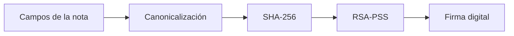

# Modelo de seguridad

## 1. Alcance

Clínica Segura es un demostrador académico. El objetivo no es representar un EHR/HCE de producción, sino mostrar cómo controles criptográficos, de autenticación, autorización y auditoría pueden aplicarse a un flujo clínico simplificado.

## 2. Principio 1 — Autenticidad

La autenticación requiere dos factores en secuencia:

```text
Contraseña -> Argon2id -> pre_auth temporal -> TOTP -> JWT RS256
```

### Contraseña

Las contraseñas se almacenan mediante `argon2-cffi` utilizando `PasswordHasher`, que genera hashes Argon2id.

### TOTP

El segundo factor utiliza TOTP de seis dígitos. La implementación acepta una ventana de ±1 intervalo para tolerar pequeños desfases de reloj.

### Sesión

Tras completar MFA se emite un JWT firmado con **RS256**. La clave privada del servidor firma y la clave pública verifica. El token expira en 30 minutos.

## 3. Principio 2 — No repudio

Cada nota clínica se firma utilizando la llave privada del médico que la crea.



El contenido canónico concatena, en orden fijo:

```text
paciente_id | personal_id | diagnostico | tratamiento | fecha
```

El SHA-256 resultante se firma mediante **RSA-PSS + SHA-256**. La firma se almacena en Base64 junto con el hash de referencia.

La llave privada del médico está cifrada en disco. Para firmar una nueva nota, el médico debe proporcionar su contraseña para descifrarla.

## 4. Principio 3 — Trazabilidad

Cada evento de auditoría enlaza su hash con el evento anterior:

```text
hash_actual = SHA-256(
    hash_anterior
    + id
    + personal_id
    + entidad_afectada
    + entidad_id
    + accion
    + detalle
    + fecha_hora
)
```

La cadena comienza con un hash génesis de 64 ceros.

### Controles de inmutabilidad de demo

SQLite incorpora triggers que rechazan:

```text
UPDATE audit_log
DELETE FROM audit_log
```

El verificador vuelve a calcular cada eslabón y valida tanto `hash_anterior` como `hash_actual`.

## 5. Control de acceso por roles

La implementación actual sigue esta matriz:

| Acción | Admin | Doctor | Enfermero | Administrativo |
|---|:---:|:---:|:---:|:---:|
| Ver expedientes | — | ✓ | ✓ | ✓ |
| Crear nota clínica | — | ✓ | ✗ | ✗ |
| Ver auditoría | ✓ | ✓ | ✗ | ✓ |
| Ver eventos de sesión | ✓ | ✓ | ✗ | ✓ |
| Exportar auditoría CSV | ✓ | ✓ | ✗ | ✓ |
| Gestión de usuarios | ✓ | ✗ | ✗ | ✗ |
| Panel de demo | ✓ | ✓ | ✓ | ✓ |

Los intentos de acceso no permitido a recursos clínicos se registran como `ACCESO_DENEGADO`.

## 6. Controles web adicionales

### CSRF

Los formularios POST utilizan un esquema double-submit cookie. El token del formulario se compara con la cookie `csrf_token`. Las cookies relevantes utilizan `SameSite=Strict`.

### Rate limiting

Política de login/MFA:

- ventana de observación: 5 minutos;
- máximo: 5 fallos;
- bloqueo: 15 minutos.

El mecanismo es en memoria y está diseñado para un solo proceso Uvicorn.

### SQL Injection

Los repositorios utilizan consultas parametrizadas de SQLite y evitan concatenar datos de entrada en las sentencias SQL.

### XSS

Las plantillas Jinja2 mantienen el autoescape por defecto para contenido HTML.

### Documentación de API

La aplicación deshabilita Swagger UI y ReDoc mediante `docs_url=None` y `redoc_url=None`.

## 7. Recursos deliberadamente inseguros de la demo

Cuando `DEMO_MODE=true`, el sistema monta rutas destinadas únicamente a la exposición. Entre ellas se encuentra `/demo/codigos`, que permite consultar TOTP vigentes sin un dispositivo real.

También existen acciones que simulan manipulación directa de datos y un intento de borrado de auditoría.

Estas funciones son una característica pedagógica, no un control de producción.

## 8. Limitaciones conocidas

1. La clave privada del servidor JWT se almacena sin cifrar en el sistema de archivos local.
2. Las cookies de la demo HTTP local no establecen `Secure`.
3. La clave `SECRET_KEY` tiene un valor de desarrollo si no se proporciona una variable de entorno.
4. SQLite y sus triggers no sustituyen almacenamiento WORM, HSM, SIEM ni controles del sistema operativo.
5. La nota clínica y el evento de auditoría se confirman actualmente en transacciones separadas.
6. `ip_origen` se almacena en auditoría pero no forma parte de la fórmula SHA-256 encadenada.
7. El rate limiter en memoria no debe utilizarse con múltiples workers sin un almacén compartido.
8. `DEMO_MODE` debe estar deshabilitado fuera de una demostración controlada.

## 9. Datos que no deben versionarse

Nunca incluir en Git:

- `db/clinica.db`
- `llaves/*.pem`
- `llaves/qr_*.png`
- `.env`
- secretos TOTP
- JWT/cookies activos
- datos clínicos o personales reales
